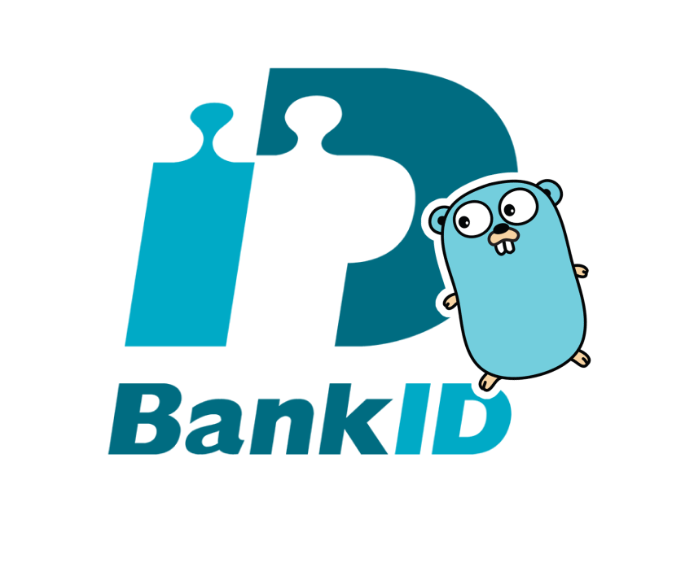

<div align="center">
    
</div>

# 🇸🇪 BankID
  


### Who is this repository for? 
You can use this repo if you're using BankID in your organization for one of the following purposes: 
- Authenticating users to use your services
- Signing documents, transactions or payments related to your organization

### Examples
```go
// Provide certificate and URL
b, err := bankid.New(bankid.Config{
    URL: bankid.BankIDURL,
    Certificate: bankid.P12Certificate{
        Passphrase:     passphrase,
        P12Certificate: p12Cert,
    },
})

// Send authenticate request to BankID
authResponse, err := b.Auth(ctx, bankid.AuthRequest{
    EndUserIP: ip,
    Requirement: &bankid.Requirement{
        PersonalNumber: personNummer,
    },
})

// Poll for the status of the order
collectResponse, err := b.Collect(ctx, bankid.CollectRequest{
    OrderRef: authResponse.OrderRef,
})

fmt.Println(collectResponse)
// Success case
// {
//         "orderRef": "5cc86d87-ded0-43c3-8ce8-7693710a0092",
//         "status": "complete",
//         "completionData": {
//                 "user": {
//                         "personalNumber": "199510221287",
//                         "name": "John Doe",
//                         "givenName": "John",
//                         "surname": "Doe"
//                 },
//                 ...
//         }
//  }
```